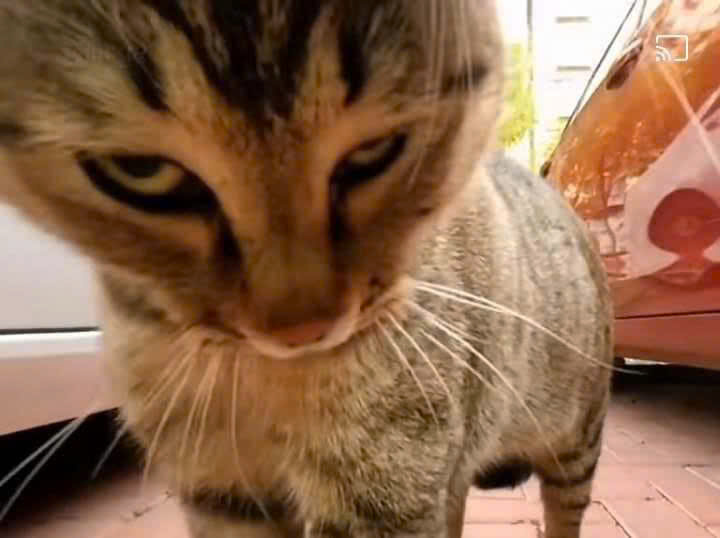

<!--  -->

 

 

 

<!--  -->

<h2 align="center">Helu 👋, I'm VO LE NGOC THUAN, I was born on May 5, 2004, Glad to have you visit my page 😽</h2>

  <h3 align="center">A simple guy, chill guy from Vietnam 🇻🇳 </h3>

## 📫 How to reach me:

   
   
  
  

## Skills:

  
  
  
  
  
  
  
  
  
  

## Activities:             
<table style="width:100%;">
  <tr>
    <td>
      
      
    </td>
    <td>
      
 
        
        
        
        
      

    </td>
  </tr>
</table>

